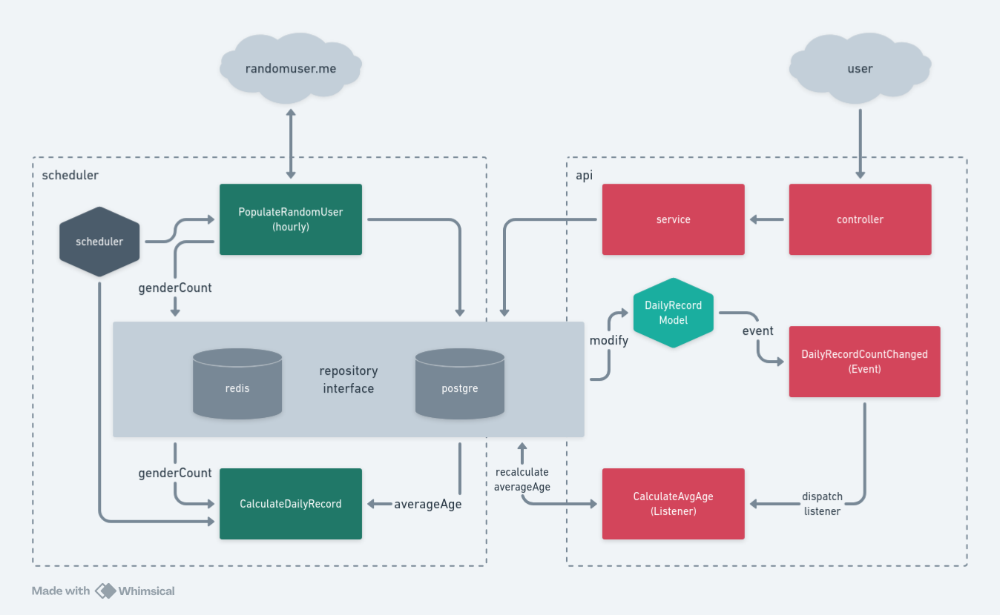

# Peasy.ai Laravel test

## Description
### Outermost Layer 
There are Scheduler and Controller from api route.  

### Service / Logic Layer
Job `PopulateRandomUser` to fetch from
`randomuser.me`, and store the data to postgre and redis as counter cache. 
I use `Redis::incr()` instead, so i dont need to use 2 commands (`Redis::get()` & `Redis::set()`).  

Job `CalculateDailyRecord` will work to get
count from cache and calculate average age based on each genders. I use `getAvgGenderAgeByDate` so i can execute sql
query once for both genders.

From api delete user, `SiteService` will get DailyRecord by its date, and decrease `<gender>_count`, so it will trigger
"Model Event", and the listener will re-calculate the average.

### Repository Layer  
There are 3 repositories:  
1. **source**: Random users source api
2. **cache**: using redis to cache hourly gender count
3. **persistent**: using postgres to store all persitent data and report.  

## Development
using dev container, you can easily run this project just by using docker and vscode.  
using [karma-runner](karma-runner.github.io/6.4/dev/git-commit-msg.html) git commit convention.  

